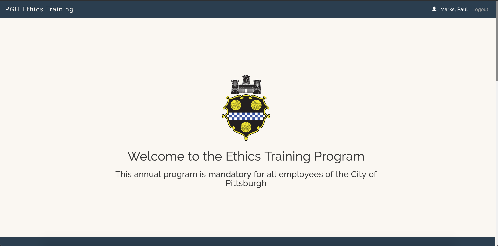

# PGH Ethics Training

PGH Ethics Training was developed for the Law Department at the City of Pittsburgh to provide a legislatively mandated training program to City employees and City affiliates.  The program consists of a video created by the Law Dept, and a series of multiple choice questions.  

PGH Ethics Training interfaces with Sharepoint as a data store via the [365-proxy](https://github.com/CityofPittsburgh/365-api).  For external users, user accounts are created and stored in MongoDB via the [mongo-proxy](https://github.com/CityofPittsburgh/mongo).  Email correspondence used throughout the authentication & access modules is handled with  Sendgrid.



## A note on boilerplate

The bones of PGH Ethics Training are shared across all client applications developed by Paul Marks for the City of Pittsburgh.  For more in-depth documentation on the structure,  design choices, authentication flow, and installation procedures for this application, please see the documentation for the [boilerplate](https://github.com/CityofPittsburgh/react-typescript-boilerplate).

This README will focus only on the components of this application that are unique to PGH Ethics Training.

## Authentication & Access

Unlike all other internal applications developed for the City, this one is unique in that it can also accomodate external users.  External users can create an account for this site specifically.  All user accounts are stored in an Azure hosted instance of MongoDB, and authentication occurs via [passport](http://www.passportjs.org/).  The authentication flow for external users is housed in the auth directory:

    ...
    auth
    ├── assets                  # Static assets used throughout auth flow
    ├── controllers 
        ├── externalUser        # contains all functions relating to account creation, authentication, password resets, etc.
        ├── internalUser.js     # Outlook OAuth flow
    ├── models     
        ├── user.js             # Mongo model for user accounts
    ├── views                   # Templates and views for auth flow
    config
    ├── passport.js             # Passport config for both internal users, and external users


## Application structure
    ...
    app
    ├── src                         
        ├── components        
            |── exam        # All markup and functions used in the exam component
            |── video       # Training video
        ├── store                   
            |── myCourses   # Collection of the logged-in user's course history

## Running Locally

### Prerequisites

* [Node.js](https://nodejs.org) - JS runtime
* .env - See .env.example for all required secrets

### Installation
```
git clone https://github.com/CityofPittsburgh/ethics-training
cd ethics-training
// first, install dependencies for the server
npm install
// then, install dependencies for the client
cd app
npm install
// to run the app locally and bypass auth
npm start
// to bundle the app for deployment
npm run build
// to run the app from the minified build, with auth workflow
cd ..
node server.js
```

## Deployment

Both staging and production services are hosted in Azure.  Application is deployed directly from github, and can be triggered either (a) through the Azure GUI, (b) through the [CLI](https://docs.microsoft.com/en-us/cli/azure/webapp/deployment/source?view=azure-cli-latest#az-webapp-deployment-source-sync), or (c) through the [proxy service](https://github.com/CityofPittsburgh/azure-proxy).

For complete documentation on the azure environment, see [here](https://github.com/CityofPittsburgh/all-things-azure.git).

## License

This project is licensed under the MIT License - see the [LICENSE.md](LICENSE.md) file for details